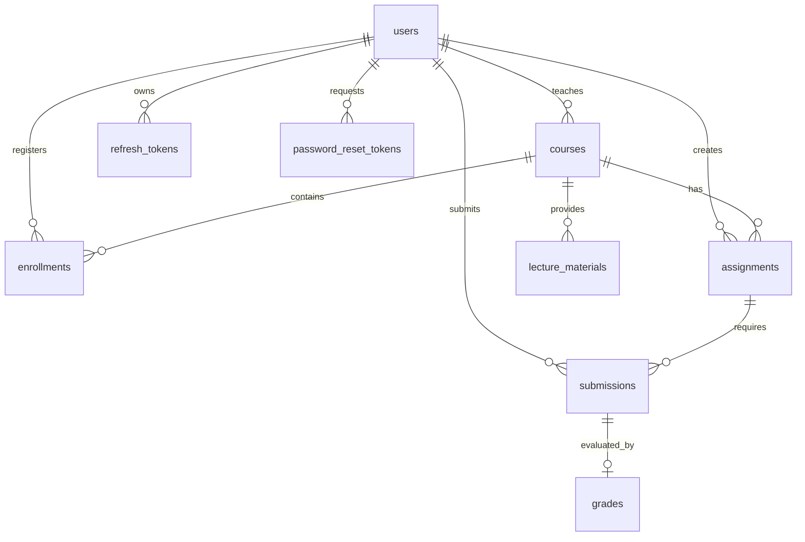

# 🎓 TÀI LIỆU ÔN TẬP BẢO VỆ ĐỒ ÁN TOÀN DIỆN (ULTIMATE GUIDE)
## Dự án: Hệ thống quản lý khóa học và chấm điểm dự án (CourseHub)

Tài liệu này được biên soạn siêu chi tiết dành cho người bảo vệ đồ án. Tài liệu bóc tách từng file code, từng bảng cơ sở dữ liệu, từng luồng đi và tất cả lý thuyết liên quan để bạn nắm giữ 100% công nghệ của dự án.

---

## 🗺️ PHẦN 1: CẤU TRÚC THƯ MỤC VÀ TẤT CẢ FILE CODE

Dự án tuân thủ kiến trúc phân lớp hướng đối tượng. Dưới đây là ý nghĩa chi tiết của từng gói (`package`) và các file quan trọng trong thư mục nguồn `src/main/java/com/k24/coursegradingmanagementsystem/`:

### 1. `aspect` (Lập trình hướng khía cạnh - AOP)
Dùng để tách biệt các tác vụ phụ trợ (ghi log hệ thống) ra khỏi mã nguồn chính.
*   `LogExecutionTime.java`: Annotation tự định nghĩa (Custom Annotation) dùng để gắn lên các hàm cần đo thời gian chạy.
*   `ExecutionTimeAspect.java`: Chứa logic thực tế để bắt các hàm có gắn `@LogExecutionTime`. Đo thời gian thực hiện bằng `System.nanoTime()`, trích xuất thông tin người dùng đang đăng nhập và ghi vào log. Ngoài ra, lớp này còn bắt riêng các luồng thành công/thất bại của việc chấm điểm (`GradeService.gradeSubmission`) để ghi log đặc thù cho việc giảng dạy.

### 2. `config` (Cấu hình hệ thống)
*   `SecurityConfig.java`: Cấu hình bảo mật chính của Spring Security. Khai báo các đường dẫn nào được phép truy cập tự do (ví dụ: login, register, swagger) và đường dẫn nào bắt buộc phải đăng nhập. Khai báo cấu hình CORS (cho phép frontend gọi API), vô hiệu hóa CSRF (vì hệ thống dùng stateless JWT), cấu hình bộ mã hóa mật khẩu `BCryptPasswordEncoder` và tiêm `JwtAuthenticationFilter` vào chuỗi lọc.
*   `RedisConfig.java`: Cấu hình kết nối tới Redis Server. Cấu hình serializer cho `RedisTemplate` để chuyển đổi dữ liệu dạng text/JSON trước khi lưu vào RAM Redis.
*   `OpenApiConfig.java`: Cấu hình cho Swagger UI, định nghĩa cơ chế bảo mật JWT `Bearer Authentication` để hiển thị nút khóa bảo mật (Authorize) trên giao diện web Swagger.

### 3. `controller` (Tầng điều phối - Endpoints)
Nhận request HTTP từ Client, thực hiện validate dữ liệu đầu vào thông qua các annotation như `@Valid`, phân quyền vai trò người dùng bằng `@PreAuthorize`, và gọi xuống lớp Service xử lý.
*   `auth/AuthController.java`: Chứa các API liên quan đến tài khoản: Đăng nhập (`/login`), Đăng ký học sinh (`/register/students`), Đăng xuất (`/logout`), Đổi mật khẩu (`/change-password`), Quên mật khẩu (`/forgot-password`), Đặt lại mật khẩu (`/reset-password`), Gia hạn token (`/refresh`).
*   `admin/AdminUserController.java` & `AdminCourseController.java`: Dành riêng cho `ADMIN` quản lý tài khoản người dùng và thông tin khóa học (CRUD khóa học, gán giảng viên, đổi trạng thái mở/đóng lớp).
*   `lecturer/LecturerCourseController.java`: Dành cho giảng viên tạo bài tập lớn, đăng tài liệu học tập (`.pdf`, `.docx`,...) và chấm điểm bài nộp của học sinh.
*   `student/StudentCourseController.java`: Dành cho sinh viên xem các khóa học mở đăng ký, đăng ký tham gia lớp học, tải tài liệu bài giảng, nộp liên kết Github bài tập hoặc file báo cáo, và xem điểm số của mình.

### 4. `dto` (Data Transfer Object - Đối tượng truyền tải dữ liệu)
Là các lớp chứa thuộc tính thô dùng để nhận yêu cầu từ Client gửi lên (Request DTO) hoặc chuẩn hóa cấu trúc dữ liệu trả về cho Client (Response DTO). Việc này giúp ẩn đi cấu trúc thực tế của các Entity dưới database để tăng tính bảo mật.
*   `request/*`: Các dữ liệu gửi lên (Ví dụ: `LoginRequest`, `CreateCourseRequest`, `GradeSubmissionRequest`).
*   `response/*`: Các dữ liệu trả về (Ví dụ: `AuthResponse`, `CourseResponse`, `UserResponse`).
*   `common/*`: Chứa cấu trúc JSON chung phản hồi của toàn bộ API (`ApiResponse`) và cấu trúc phân trang (`PagedResponse`).

### 5. `entity` (Thực thể - JPA Models)
Các lớp Java đại diện trực tiếp cho các bảng tương ứng trong cơ sở dữ liệu MySQL. Các thuộc tính trong lớp này map 1-1 với cột trong DB nhờ annotation `@Column`.
*   `User.java`, `Course.java`, `Enrollment.java`, `Assignment.java`, `Submission.java`, `Grade.java`, `LectureMaterial.java`, `RefreshToken.java`, `TokenBlacklist.java`, `PasswordResetToken.java`.

### 6. `enums` (Kiểu liệt kê)
Định nghĩa tập hợp các hằng số cố định nhằm đảm bảo tính toàn vẹn dữ liệu:
*   `Role.java`: Quyền hạn (`ADMIN`, `LECTURER`, `STUDENT`).
*   `CourseStatus.java`: Trạng thái lớp (`DRAFT`, `OPEN`, `IN_PROGRESS`, `COMPLETED`, `CLOSED`).
*   `EnrollmentStatus.java`: Trạng thái đăng ký lớp của học sinh (`ENROLLED`, `CANCELLED`, `COMPLETED`).
*   `SubmissionStatus.java`: Trạng thái nộp bài (`PENDING`, `SUBMITTED`, `LATE`, `GRADED`).

### 7. `exception` (Xử lý ngoại lệ)
*   Chứa các Exception tự định nghĩa như `ConflictException` (Lỗi trùng dữ liệu), `ResourceNotFoundException` (Lỗi không tìm thấy dữ liệu), `BusinessRuleException` (Lỗi vi phạm quy tắc nghiệp vụ),...
*   `GlobalExceptionHandler.java`: Lớp trung tâm bắt tất cả các Exception xảy ra trong ứng dụng. Nó định dạng các lỗi này thành cấu trúc JSON chuẩn `ApiErrorResponse` và trả về HTTP status code phù hợp (ví dụ: lỗi validate ➔ 400 Bad Request, lỗi sai mật khẩu ➔ 401 Unauthorized, lỗi trùng ➔ 409 Conflict).

### 8. `mapper` (Chuyển đổi đối tượng)
*   Chứa các lớp Java thô (không dùng thư viện ngoài để tối ưu tốc độ) thực hiện chuyển đổi qua lại giữa Entity và DTO (Ví dụ: `UserMapper.toResponse(User user)` nhận vào một Entity User và trả về một `UserResponse` chỉ chứa các thông tin công khai).

### 9. `repository` (Tầng truy vấn dữ liệu)
Là các interface kế thừa `JpaRepository` của Spring Data JPA. Nó tự động tạo các câu lệnh SQL tương tác với DB MySQL dựa vào tên hàm (Query Method) hoặc thông qua annotation `@Query`.
*   `UserRepository.java`, `CourseRepository.java`, `EnrollmentRepository.java`,...

### 10. `security` (Tầng bảo mật hệ thống)
*   `JwtProvider.java`: Lớp tạo mã và giải mã JWT token. Chứa các hàm: `generateAccessToken`, `generateRefreshToken`, `validateToken` (kiểm tra hạn dùng và chữ ký số), `getClaimsFromToken` (đọc dữ liệu người dùng ẩn trong token).
*   `JwtAuthenticationFilter.java`: Bộ lọc chặn mọi request API gửi lên. Nó đọc Access Token từ Header, xác thực chữ ký của Token qua `JwtProvider`, kiểm tra xem token này có nằm trong danh sách đen Redis/MySQL hay không. Nếu hợp lệ, nó sẽ lấy thông tin User tiêm vào ngữ cảnh bảo mật của Spring Security (`SecurityContextHolder`) để các controller biết ai đang gọi API.
*   `CustomUserDetails.java`: Lớp bọc thông tin người dùng JPA Entity để tương thích với các API phân quyền của Spring Security.

### 11. `service` (Tầng xử lý logic nghiệp vụ)
Định nghĩa các Interface nghiệp vụ và các lớp hiện thực hóa (`service/impl/*`) chứa logic xử lý nghiệp vụ chính của đồ án.
*   `AuthServiceImpl.java`, `UserServiceImpl.java`, `CourseServiceImpl.java`, `EnrollmentServiceImpl.java`, `SubmissionServiceImpl.java`, `GradeServiceImpl.java`, `LectureMaterialServiceImpl.java`, `RevokedTokenServiceImpl.java` (quản lý lưu blacklist token trên Redis/MySQL).

---

## 🗄️ PHẦN 2: THIẾT KẾ CƠ SỞ DỮ LIỆU CHI TIẾT (DATABASE SCHEMA)

Dự án gồm **10 bảng cơ sở dữ liệu quan hệ** được chuẩn hóa tối đa để tránh dư thừa dữ liệu. Dưới đây là mô tả chi tiết:

### Sơ đồ liên kết thực thể (ERD) bằng Mermaid


### Chi tiết cấu trúc 10 bảng trong DB:

#### 1. Bảng Người dùng (`users`)
Lưu thông tin tài khoản của cả Admin, Giảng viên và Sinh viên.
*   `id` (BIGINT, Primary Key, Auto Increment)
*   `username` (VARCHAR(50), NOT NULL, UNIQUE): Tên đăng nhập.
*   `email` (VARCHAR(100), NOT NULL, UNIQUE): Email liên hệ.
*   `password_hash` (VARCHAR(100), NOT NULL): Mật khẩu băm một chiều BCrypt.
*   `full_name` (VARCHAR(100), NOT NULL): Họ và tên đầy đủ.
*   `phone` (VARCHAR(20), UNIQUE): Số điện thoại duy nhất (đã được validate không trùng).
*   `role` (VARCHAR(20), NOT NULL): Vai trò (`ADMIN`, `LECTURER`, `STUDENT`).
*   `is_active` (BOOLEAN, NOT NULL, DEFAULT TRUE): Trạng thái tài khoản (Cho phép/Khóa hoạt động).

#### 2. Bảng Khóa học (`courses`)
Lưu danh sách các khóa học do Admin khởi tạo và phân giảng viên phụ trách.
*   `id` (BIGINT, Primary Key, Auto Increment)
*   `course_code` (VARCHAR(30), NOT NULL, UNIQUE): Mã khóa học (Ví dụ: `JAVA101`).
*   `course_name` (VARCHAR(150), NOT NULL): Tên khóa học.
*   `description` (TEXT): Mô tả nội dung.
*   `credit` (INT, NOT NULL): Số tín chỉ (Tối thiểu là 1).
*   `lecturer_id` (BIGINT, Foreign Key references `users.id`): ID của Giảng viên phụ trách.
*   `maximum_students` (INT, NOT NULL): Số lượng học sinh tối đa được phép đăng ký.
*   `start_date` (DATE, NOT NULL): Ngày khai giảng.
*   `end_date` (DATE, NOT NULL): Ngày kết thúc khóa học.
*   `status` (VARCHAR(30), NOT NULL, DEFAULT 'DRAFT'): Trạng thái lớp học (`DRAFT`, `OPEN`, `IN_PROGRESS`, `COMPLETED`, `CLOSED`).

#### 3. Bảng Đăng ký khóa học (`enrollments`)
Bảng trung gian thể hiện mối quan hệ Nhiều-Nhiều giữa Sinh viên và Khóa học.
*   `id` (BIGINT, Primary Key, Auto Increment)
*   `course_id` (BIGINT, Foreign Key references `courses.id`): ID khóa học.
*   `student_id` (BIGINT, Foreign Key references `users.id`): ID sinh viên tham gia.
*   `status` (VARCHAR(30), NOT NULL, DEFAULT 'ENROLLED'): Trạng thái đăng ký (`ENROLLED`, `CANCELLED`, `COMPLETED`).
*   **Ràng buộc Unique**: `uq_course_student (course_id, student_id)` đảm bảo một sinh viên không thể đăng ký học một môn học nhiều lần cùng lúc.

#### 4. Bảng Bài tập lớn (`assignments`)
Do giảng viên tạo ra cho từng khóa học mà mình giảng dạy.
*   `id` (BIGINT, Primary Key, Auto Increment)
*   `course_id` (BIGINT, Foreign Key references `courses.id`): Khóa học áp dụng bài tập này.
*   `title` (VARCHAR(150), NOT NULL): Tiêu đề bài tập lớn.
*   `description` (TEXT): Yêu cầu đề bài.
*   `instructions` (TEXT): Hướng dẫn nộp bài (Ví dụ: Định dạng nộp bài).
*   `maximum_score` (DOUBLE, NOT NULL, DEFAULT 100.0): Thang điểm tối đa.
*   `open_at` (TIMESTAMP, NOT NULL): Thời gian bắt đầu mở cổng nộp.
*   `due_at` (TIMESTAMP, NOT NULL): Hạn nộp bài.
*   `allow_late_submission` (BOOLEAN, NOT NULL, DEFAULT FALSE): Cho phép nộp muộn sau deadline không.
*   `status` (VARCHAR(30), NOT NULL, DEFAULT 'DRAFT'): Trạng thái bài tập (`DRAFT`, `OPEN`, `CLOSED`).

#### 5. Bảng Bài nộp của học sinh (`submissions`)
Ghi nhận bài làm thực tế của sinh viên đối với bài tập lớn.
*   `id` (BIGINT, Primary Key, Auto Increment)
*   `assignment_id` (BIGINT, Foreign Key references `assignments.id`): Bài tập lớn tương ứng.
*   `student_id` (BIGINT, Foreign Key references `users.id`): Sinh viên nộp bài.
*   `github_url` (VARCHAR(255)): Link chứa source code github bài làm.
*   `report_url` (VARCHAR(255)): Đường dẫn file báo cáo PDF lưu trên ổ đĩa Server.
*   `original_file_name` (VARCHAR(255)): Tên gốc của file báo cáo do sinh viên tải lên.
*   `file_type` (VARCHAR(50)): Định dạng file (PDF, DOCX).
*   `status` (VARCHAR(30), NOT NULL, DEFAULT 'PENDING'): Trạng thái bài nộp (`PENDING`, `SUBMITTED`, `LATE`, `GRADED`).
*   `submitted_at` (TIMESTAMP): Thời gian thực tế sinh viên nhấn nộp bài.
*   **Ràng buộc Unique**: `uq_assignment_student (assignment_id, student_id)` đảm bảo mỗi sinh viên chỉ có duy nhất 1 bản ghi bài làm cho mỗi bài tập lớn.

#### 6. Bảng Điểm số (`grades`)
Lưu kết quả đánh giá của Giảng viên dành cho bài nộp của Sinh viên (Quan hệ 1-1 với bảng `submissions`).
*   `id` (BIGINT, Primary Key, Auto Increment)
*   `submission_id` (BIGINT, Foreign Key references `submissions.id`, UNIQUE): Bài làm được chấm điểm.
*   `lecturer_id` (BIGINT, Foreign Key references `users.id`): Giảng viên chấm điểm.
*   `score` (DOUBLE, NOT NULL): Điểm số chấm (Phải nằm trong khoảng 0.0 đến `maximum_score`).
*   `feedback` (TEXT): Lời nhận xét, phản hồi của giảng viên.
*   `graded_at` (TIMESTAMP, NOT NULL, DEFAULT CURRENT_TIMESTAMP): Ngày chấm điểm.

#### 7. Bảng Tài liệu bài giảng (`lecture_materials`)
Tài liệu học tập do Giảng viên đăng lên cho lớp học.
*   `id` (BIGINT, Primary Key, Auto Increment)
*   `course_id` (BIGINT, Foreign Key references `courses.id`): Khóa học nhận tài liệu.
*   `lecturer_id` (BIGINT, Foreign Key references `users.id`): Người đăng.
*   `title` (VARCHAR(150), NOT NULL): Tiêu đề tài liệu (ví dụ: Slide Chương 1).
*   `description` (TEXT): Mô tả nội dung tài liệu.
*   `file_url` (VARCHAR(255), NOT NULL): Đường dẫn lưu file trên Server.
*   `original_file_name` (VARCHAR(255), NOT NULL): Tên gốc của file.
*   `file_type` (VARCHAR(50), NOT NULL): Định dạng file.
*   `file_size` (BIGINT, NOT NULL): Dung lượng file (Dùng để kiểm soát giới hạn tối đa 15MB).

#### 8. Bảng Tokens gia hạn (`refresh_tokens`)
*   `id` (BIGINT, Primary Key, Auto Increment)
*   `user_id` (BIGINT, Foreign Key references `users.id`): Chủ nhân token.
*   `token_id` (VARCHAR(100), NOT NULL, UNIQUE): Mã định danh token (JTI).
*   `token_hash` (VARCHAR(100), NOT NULL): Mã hash Bcrypt của Refresh Token.
*   `expires_at` (TIMESTAMP, NOT NULL): Ngày hết hạn.
*   `revoked` (BOOLEAN, NOT NULL, DEFAULT FALSE): Token đã bị hủy chưa.
*   `replaced_by_token_id` (VARCHAR(100)): ID của token mới thay thế nó sau khi thực hiện cơ chế xoay vòng.

#### 9. Bảng Danh sách đen Token (`token_blacklist`)
*Dự phòng lưu trữ cho Redis khi offline.*
*   `id` (BIGINT, Primary Key, Auto Increment)
*   `user_id` (BIGINT, Foreign Key references `users.id`): Người đăng xuất.
*   `token_id` (VARCHAR(100), NOT NULL, UNIQUE): Mã JTI của Access Token cần thu hồi.
*   `revoked_at` (TIMESTAMP, NOT NULL, DEFAULT CURRENT_TIMESTAMP): Thời điểm đăng xuất.
*   `expires_at` (TIMESTAMP, NOT NULL): Thời điểm hết hạn của Access Token gốc.

#### 10. Bảng Mã đặt lại mật khẩu (`password_reset_tokens`)
*   `id` (BIGINT, Primary Key, Auto Increment)
*   `user_id` (BIGINT, Foreign Key references `users.id`): Người yêu cầu.
*   `token_hash` (VARCHAR(100), NOT NULL, UNIQUE): Mã hash Bcrypt của token lấy lại mật khẩu.
*   `expires_at` (TIMESTAMP, NOT NULL): Thời hạn sử dụng (30 phút).
*   `used` (BOOLEAN, NOT NULL, DEFAULT FALSE): Mã này đã dùng chưa.

---

## 🛠️ PHẦN 3: LÝ THUYẾT CHI TIẾT VÀ GIẢI THÍCH CƠ CHẾ HOẠT ĐỘNG

### 1. Chuỗi lọc bảo mật Spring Security (Filter Chain) & Cơ chế JWT
Khi một request HTTP gửi từ Client lên Server, nó không đi thẳng vào Controller mà phải đi qua một loạt các bộ lọc (Filter Chain).
```text
HTTP Request ➔ CorsFilter (Kiểm tra CORS) ➔ UsernamePasswordAuthenticationFilter 
             ➔ JwtAuthenticationFilter (BỘ LỌC CỦA CHÚNG TA) ➔ Controller
```

#### Chi tiết cách `JwtAuthenticationFilter` hoạt động:
1.  **Đọc Header**: Trích xuất chuỗi Header `Authorization`. Nếu trống hoặc không bắt đầu bằng `Bearer `, bộ lọc sẽ bỏ qua và cho đi tiếp (Lúc này request sẽ không có thông tin đăng nhập, nếu truy cập API bảo mật sẽ bị Spring Security chặn lại trả về 401).
2.  **Đọc Access Token**: Cắt bỏ chữ `Bearer ` để lấy Access Token thô.
3.  **Xác thực Token**: Gọi `jwtProvider.validateToken(token)` để:
    *   Kiểm tra chữ ký số (Signature) có khớp với mã khóa bí mật `JWT_SECRET` không (Đảm bảo token không bị sửa đổi thông tin).
    *   Kiểm tra hạn sử dụng của token.
4.  **Kiểm tra Blacklist (Thu hồi)**: Gọi `revokedTokenService.isRevoked(jti)` để check xem token này đã bị đăng xuất chưa. Hệ thống sẽ check trên **Redis** trước. Nếu Redis offline, hệ thống tự động nhảy xuống kiểm tra trong bảng `token_blacklist` của **MySQL**.
5.  **Tiêm ngữ cảnh bảo mật**: Nếu token hợp lệ, lấy ra thông tin `userId`, `username`, `role` từ Payload của token thô, bọc nó vào đối tượng `UsernamePasswordAuthenticationToken` và đưa vào ngữ cảnh bảo mật `SecurityContextHolder`. Kể từ đây, Spring Security ghi nhận request này đã được đăng nhập hợp lệ.

---

### 2. Các Annotation của JPA / Hibernate thường dùng
JPA (Java Persistence API) là chuẩn kết nối Java với DB. Hibernate là thư viện thực thi chuẩn đó.
*   `@Entity`: Đánh dấu lớp Java là một thực thể JPA đại diện cho một bảng dữ liệu trong Database.
*   `@Table(name = "tên_bảng")`: Khai báo chính xác tên bảng trong MySQL tương ứng với Entity này.
*   `@Id`: Khai báo thuộc tính là Khóa chính (Primary Key).
*   `@GeneratedValue(strategy = GenerationType.IDENTITY)`: Khai báo trường khóa chính tự động tăng (Auto Increment) do Database MySQL quản lý.
*   `@Column(name = "tên_cột", nullable = false, unique = true)`: Định nghĩa chi tiết cấu trúc cột trong DB (tên cột, không được phép trống, giá trị là duy nhất).
*   `@ManyToOne`: Đại diện mối quan hệ Nhiều-Một (Nhiều bài tập lớn thuộc về Một khóa học). Tự động tạo ra một khóa ngoại (Foreign Key) trỏ tới bảng kia.
*   `@OneToOne`: Đại diện mối quan hệ Một-Một (Một bài nộp chỉ có duy nhất một bản ghi điểm số).
*   `@PrePersist`: Annotation đánh dấu hàm tự động chạy trước khi câu lệnh SQL `INSERT` được thực thi (Ví dụ: tự động gán ngày tạo `created_at` bằng giờ hiện tại của hệ thống).
*   `@PreUpdate`: Hàm tự động chạy trước khi SQL `UPDATE` thực thi (Ví dụ: tự động cập nhật thời gian chỉnh sửa `updated_at`).

---

### 3. Spring Bean và Cơ chế Dependency Injection (Constructor Injection)
*   **Spring Bean**: Là các đối tượng (Object) được khởi tạo, quản lý và cấu hình hoàn toàn bởi Spring IoC Container.
*   **Dependency Injection (DI)**: Là kỹ thuật truyền các đối tượng phụ thuộc vào trong một lớp thay vì lớp đó tự đi khởi tạo.
*   **Tại sao Constructor Injection tốt nhất?**
    *   **Immutability (Bất biến)**: Các thuộc tính tiêm vào được khai báo là `final`, ngăn chặn việc thay đổi giá trị của chúng trong suốt quá trình chạy ứng dụng.
    *   **Dễ kiểm thử (Testing)**: Khi viết Unit test, bạn có thể dễ dàng truyền các mock object vào class thông qua constructor mà không cần chạy toàn bộ Spring Container hoặc dùng Reflection.
    *   **Tránh NullPointerException**: Spring đảm bảo tất cả các dependencies trong Constructor đều phải được khởi tạo trước khi tạo ra lớp đó. Nếu thiếu, ứng dụng sẽ báo lỗi ngay khi khởi động (Fail-fast) thay vị bị lỗi khi đang chạy.

---

### 4. Cơ chế hoạt động của Spring AOP (Aspect-Oriented Programming)
Spring AOP hoạt động dựa trên cơ chế **Dynamic Proxy** (Ủy quyền động).
1.  Khi Spring Container phát hiện một Bean (ví dụ: `AuthController`) có các hàm được cấu hình là Pointcut của một Aspect (như ghi log thời gian chạy).
2.  Spring sẽ không tiêm trực tiếp Bean nguyên bản `AuthController` vào hệ thống, mà tạo ra một đối tượng **Proxy** (đối tượng đại diện trung gian) bọc lấy `AuthController`.
3.  Khi Client gọi API login, thực tế họ đang gọi vào đối tượng Proxy này.
4.  Proxy sẽ thực thi đoạn code ghi log thời gian chạy trước (`@Around` bắt đầu), sau đó nó chuyển quyền thực thi về cho hàm `login()` gốc của `AuthController` thông qua lệnh `joinPoint.proceed()`, và sau khi hàm gốc hoàn thành, nó chạy tiếp đoạn code tính tổng thời gian và in ra log.

---

### 5. Cơ chế quản lý Database Migration với Flyway DB
Trong các dự án thực tế lớn, ta không tạo bảng thủ công bằng tay vì khi deploy lên server hoặc chạy máy khác sẽ mất dữ liệu và khó đồng bộ cấu trúc bảng.
*   **Cách hoạt động**:
    *   Mỗi khi có thay đổi cấu trúc bảng (ví dụ: thêm cột, tạo bảng mới), lập trình viên viết một file SQL đặt tên đúng chuẩn quy định vào thư mục `src/main/resources/db/migration/` (Ví dụ: `V1__create_users.sql`, `V2__create_courses.sql`).
    *   Khi ứng dụng Spring Boot khởi động, Flyway tự động đọc bảng quản lý `flyway_schema_history` trong Database.
    *   Nó đối chiếu xem file SQL nào trong thư mục code có mã phiên bản (V1, V2...) lớn hơn phiên bản hiện tại dưới DB.
    *   Nó sẽ chạy tuần tự các câu lệnh trong các file SQL mới đó để đồng bộ cấu trúc bảng tự động và ghi nhận phiên bản mới nhất vào bảng lịch sử.
    *   **Checksum**: Flyway mã hóa nội dung các file SQL thành một chuỗi MD5 Checksum. Nếu bạn cố tình sửa đổi nội dung một file SQL đã chạy trước đó, Flyway sẽ phát hiện checksum bị thay đổi và lập tức dừng khởi động ứng dụng để cảnh báo sự sai lệch cấu trúc dữ liệu.

---

## ❓ PHẦN 4: BỘ CÂU HỎI PHẢN BIỆN CHUYÊN SÂU (20 CÂU HỎI Q&A)

#### **Câu 1: Dự án sử dụng mô hình phân lớp gì? Luồng dữ liệu đi qua các lớp này như thế nào?**
> **Trả lời:** Dự án sử dụng mô hình phân lớp chuẩn **Layered Architecture**. Luồng dữ liệu: Client gửi HTTP Request ➔ `Controller` nhận và kiểm tra cấu trúc dữ liệu đầu vào (Validation) ➔ `Service` thực thi logic nghiệp vụ và kiểm tra quy tắc kinh doanh ➔ `Repository` dịch các yêu cầu dữ liệu thành SQL và giao tiếp với MySQL DB ➔ Dữ liệu đi ngược lại qua `Mapper` để trả về JSON dạng DTO cho Client.

#### **Câu 2: DTO là gì? Tại sao phải dùng DTO mà không dùng trực tiếp các Entity JPA để nhận và trả dữ liệu?**
> **Trả lời:** DTO (Data Transfer Object) là đối tượng chuyên dùng để truyền tải dữ liệu giữa Client và Server.
> Chúng ta bắt buộc phải dùng DTO vì:
> 1. **Bảo mật**: Tránh lộ cấu trúc bảng thực tế dưới cơ sở dữ liệu (ví dụ: không bao giờ trả về trường `password_hash` của Entity User cho client).
> 2. **Tách biệt mối quan tâm (Decoupling)**: Khi database thay đổi (ví dụ: gộp cột hoặc đổi tên bảng), ta chỉ cần sửa Entity và Mapper, cấu trúc JSON trả về cho Frontend (DTO) giữ nguyên, tránh làm sập ứng dụng Frontend.
> 3. **Tối ưu băng thông**: Chỉ gửi các trường dữ liệu thực sự cần thiết thay vì toàn bộ các cột trong DB.

#### **Câu 3: Làm thế nào để kiểm soát tính hợp lệ của dữ liệu gửi lên API (Validation)? Các annotation hoạt động như thế nào?**
> **Trả lời:** Em sử dụng thư viện **Jakarta Validation** kết hợp với annotation `@Valid` ở tham số đầu vào trong Controller. Các annotation như `@NotBlank`, `@Size`, `@Email`, và `@Pattern` được gắn trực tiếp trên các thuộc tính của DTO Request. Khi nhận request, Spring Boot sẽ quét qua đối tượng DTO đó. Nếu có bất kỳ trường nào vi phạm, nó sẽ ném ra ngoại lệ `MethodArgumentNotValidException` và trả về mã lỗi 400 Bad Request cùng mô tả chi tiết trường nào bị lỗi ở phần `fieldErrors`.

#### **Câu 4: Em cấu hình xử lý lỗi tập trung như thế nào? Tại sao lại dùng cách này?**
> **Trả lời:** Em sử dụng lớp xử lý lỗi tập trung [GlobalExceptionHandler.java](file:///d:/CourseHub/docs/PROJECT_DEFENSE_GUIDE.md#L115-L125) được gắn annotation `@RestControllerAdvice`.
> Lớp này chứa các hàm lắng nghe các Exception cụ thể bằng `@ExceptionHandler`. Cách này giúp code gọn gàng, không phải viết các khối lệnh `try-catch` lặp đi lặp lại ở Controller hay Service. Hệ thống sẽ luôn trả về một định dạng JSON lỗi thống nhất (`ApiErrorResponse`) kèm mã trạng thái HTTP chuẩn (400, 401, 403, 404, 409, 500) giúp frontend dễ dàng bắt và xử lý thông báo cho người dùng.

#### **Câu 5: Tại sao khi nhập mật khẩu sai hệ thống lại trả về mã lỗi 401 thay vì mã lỗi 500? Em đã chỉnh sửa gì để đạt được điều này?**
> **Trả lời:**
> * **Trước đó**: Khi nhập mật khẩu sai, Spring Security ném ra lỗi `BadCredentialsException` (một lớp con của `AuthenticationException`). Vì trong `GlobalExceptionHandler` chưa định nghĩa bộ bắt lỗi này, nó tự động trôi xuống bộ bắt lỗi chung `Exception.class` và trả về mã lỗi mặc định `500 Internal Server Error`.
> * **Khắc phục**: Em đã thêm `AuthenticationException.class` vào trong danh sách xử lý của hàm `handleUnauthorized()` trong file [GlobalExceptionHandler.java](file:///d:/CourseHub/docs/PROJECT_DEFENSE_GUIDE.md#L40-L51), đồng thời kiểm tra nếu lỗi là `BadCredentialsException` thì trả về thông điệp dễ hiểu là `"Incorrect username or password"` kèm mã lỗi chuẩn **`401 Unauthorized`**.

#### **Câu 6: Em đã hiện thực hóa việc bảo mật số điện thoại không trùng lặp như thế nào?**
> **Trả lời:** 
> 1. Đầu tiên, em khai báo thêm hai hàm truy vấn `existsByPhone` và `findByPhone` trong [UserRepository.java](file:///d:/CourseHub/src/main/java/com/k24/coursegradingmanagementsystem/repository/UserRepository.java#L24-L26).
> 2. Trong [AuthServiceImpl.java](file:///d:/CourseHub/src/main/java/com/k24/coursegradingmanagementsystem/service/impl/AuthServiceImpl.java#L205-L208) (luồng đăng ký học sinh) và [UserServiceImpl.java](file:///d:/CourseHub/src/main/java/com/k24/coursegradingmanagementsystem/service/impl/UserServiceImpl.java#L36-L39) (luồng Admin tạo user), em kiểm tra nếu số điện thoại gửi lên đã tồn tại trong DB thì ném ra `ConflictException` để hệ thống phản hồi lỗi `409 Conflict`.
> 3. Trong luồng cập nhật thông tin (`updateUser`), em kiểm tra nếu số điện thoại thay đổi trùng với một người dùng khác (có ID khác với người dùng hiện tại) thì cũng ném lỗi `ConflictException` để chặn lại.

#### **Câu 7: JWT là gì? Ưu điểm của JWT so với cơ chế Session-Cookie truyền thống?**
> **Trả lời:** JWT (JSON Web Token) là cơ chế bảo mật dạng Token không trạng thái (Stateless).
> **Ưu điểm so với Session-Cookie**:
> 1. **Khả năng mở rộng (Scalability)**: Server không cần lưu trữ bất kỳ thông tin phiên đăng nhập nào trong bộ nhớ RAM (Session). Mọi thông tin người dùng đã được đóng gói trong Token và gửi kèm request. Nếu hệ thống nâng cấp lên nhiều cụm Server (Load Balancing), request có thể gửi đến bất kỳ server nào vẫn xác thực được mà không cần đồng bộ bộ nhớ Session.
> 2. **Chống lỗi CSRF**: JWT thường được gửi ở Header thay vì lưu tự động trong Cookie, nên giúp chống hoàn toàn các cuộc tấn công giả mạo yêu cầu chéo trang (Cross-Site Request Forgery).

#### **Câu 8: Tại sao lại cần cả Access Token và Refresh Token? Cơ chế xoay vòng Refresh Token (Token Rotation) là gì?**
> **Trả lời:**
> * **Lý do**: Nếu chỉ dùng một token có thời hạn dài, nếu kẻ xấu ăn cắp được token đó, họ có thể truy cập hệ thống lâu dài. Do đó, ta tách làm hai: `Access Token` thời hạn rất ngắn (15 phút) để nếu bị lộ thì thiệt hại cũng nhỏ. `Refresh Token` thời hạn dài (7 ngày) dùng để xin cấp lại Access Token mới.
> * **Xoay vòng Refresh Token**: Mỗi lần Client gửi Refresh Token lên để đổi Access Token mới, hệ thống sẽ hủy ngay Refresh Token cũ đó đi và trả về một Refresh Token hoàn toàn mới cùng với Access Token mới. Nếu kẻ xấu ăn cắp được Refresh Token cũ và gửi lên, hệ thống phát hiện token này đã bị hủy (tức là có kẻ gian đang cố tình tái sử dụng), lập tức thu hồi toàn bộ các phiên đăng nhập đang hoạt động của người dùng đó để đảm bảo an toàn tuyệt đối.

#### **Câu 9: Cơ chế Blacklist Token khi người dùng nhấn Logout hoạt động như thế nào?**
> **Trả lời:** JWT mặc định không thể thu hồi từ xa trước khi nó hết hạn. Do đó, khi người dùng nhấn đăng xuất, ta lấy ra ID của token (`JTI`) và thời điểm hết hạn của nó. Sau đó, ta lưu JTI này vào danh sách đen **Blacklist** trên **Redis** với thời gian sống (TTL) bằng đúng thời gian sống còn lại của token. Bộ lọc `JwtAuthenticationFilter` mỗi khi nhận request sẽ kiểm tra xem JTI của token gửi lên có nằm trong blacklist của Redis hay không. Nếu có, request lập tức bị từ chối trả về 401.

#### **Câu 10: Nếu Redis bị sập đột ngột thì luồng Logout và kiểm tra Blacklist có bị lỗi không? Em giải quyết thế nào?**
> **Trả lời:** Hệ thống sẽ **không bị lỗi** và vẫn hoạt động an toàn nhờ cơ chế **Fallback dự phòng** được viết trong [RevokedTokenServiceImpl.java](file:///d:/CourseHub/src/main/java/com/k24/coursegradingmanagementsystem/service/token/impl/RevokedTokenServiceImpl.java#L40-L53).
> Khi có sự cố kết nối tới Redis, khối lệnh `try-catch` sẽ bắt lỗi, ghi cảnh báo vào hệ thống log, và tự động chuyển luồng đọc/ghi dữ liệu danh sách đen xuống bảng `token_blacklist` trong cơ sở dữ liệu **MySQL**. Hệ thống vẫn đảm bảo tính an toàn bảo mật (Fail-safe) nhưng tốc độ sẽ bị giảm nhẹ do phải query xuống đĩa thay vì RAM.

#### **Câu 11: Lập trình hướng khía cạnh (AOP) trong dự án được dùng để làm gì? Lợi ích?**
> **Trả lời:** AOP được dùng để tự động đo đạc thời gian thực thi của tất cả các API nghiệp vụ và ghi vết hoạt động (Auditing) của Giảng viên khi chấm điểm.
> * **Lợi ích**: Giúp loại bỏ hoàn toàn mã nguồn lặp đi lặp lại (Boilerplate code). Lớp nghiệp vụ chỉ tập trung 100% vào logic chính, còn tác vụ phụ trợ (Ghi log hệ thống) được tập trung quản lý tại một file duy nhất là [ExecutionTimeAspect.java](file:///d:/CourseHub/src/main/java/com/k24/coursegradingmanagementsystem/aspect/ExecutionTimeAspect.java).

#### **Câu 12: Hãy nêu cách hoạt động của tính năng Quên mật khẩu trong dự án của em?**
> **Trả lời:** 
> 1. Khi người dùng nhập email gửi đến API `/forgot-password`, hệ thống sinh ra một mã token dạng UUID ngẫu nhiên.
> 2. Hệ thống mã hóa token này bằng BCrypt và lưu vào bảng `password_reset_tokens` cùng thời gian hết hạn là 30 phút.
> 3. Vì chưa cấu hình SMTP Server gửi mail thật, hệ thống sẽ in trực tiếp mã token UUID này ra màn hình Console chạy Spring Boot của server.
> 4. Người dùng lấy mã token này gửi kèm mật khẩu mới tới API `/reset-password` để đặt lại mật khẩu mới.

#### **Câu 13: Tại sao khi xóa khóa học đã có học sinh đăng ký, hệ thống lại chặn không cho xóa? Chặn ở lớp nào?**
> **Trả lời:** Hệ thống chặn lại để bảo vệ tính toàn vẹn của dữ liệu báo cáo điểm số học tập. Nếu xóa cứng khóa học, các bản ghi điểm số, bài nộp của sinh viên trước đó sẽ bị lỗi mồ côi (không thể liên kết tới khóa học nào).
> Lớp thực hiện chặn là tầng Service tại hàm `deleteCourse` của [CourseServiceImpl.java](file:///d:/CourseHub/src/main/java/com/k24/coursegradingmanagementsystem/service/impl/CourseServiceImpl.java#L132-L142). Hàm kiểm tra đếm số lượng bản ghi đăng ký có trạng thái là `ENROLLED` trong DB. Nếu lớn hơn 0, hệ thống từ chối xóa và ném lỗi `BusinessRuleException`.

#### **Câu 14: Khi sinh viên nhấn Hủy đăng ký khóa học, hệ thống xử lý như thế nào? Tại sao lại làm như vậy?**
> **Trả lời:** Hệ thống chỉ cập nhật trạng thái của bản ghi đăng ký học đó sang `CANCELLED` và lưu lại chứ không xóa dòng đó đi.
> Lý do:
> 1. Để giữ lại lịch sử đăng ký của sinh viên phục vụ mục đích thống kê, đối soát.
> 2. Giúp giải phóng vị trí (seat) trong lớp học để sinh viên khác đăng ký vào.
> 3. Tránh làm mất tính toàn vẹn dữ liệu liên kết nếu trước đó sinh viên đó đã lỡ nộp bài tập.

#### **Câu 15: Flyway DB hoạt động như thế nào trong dự án của em? Bảng `flyway_schema_history` dùng để làm gì?**
> **Trả lời:** Khi dự án khởi chạy, Flyway sẽ tự động quét thư mục `db/migration` để tìm các file script SQL. Nó so sánh các file này với lịch sử chạy đã lưu trong bảng `flyway_schema_history` dưới database. Nếu phát hiện file mới, nó sẽ tự động chạy lệnh SQL trong file đó để cập nhật cấu trúc database đồng bộ với code.
> Bảng `flyway_schema_history` dùng để lưu trữ lịch sử cấu trúc database, ghi lại file SQL nào đã được chạy vào thời gian nào, phiên bản hiện tại là bao nhiêu, và checksum của file đó để tránh việc sửa đổi script cũ trái phép.

#### **Câu 16: Tại sao em lại cấu hình tắt kết nối Redis mặc định (`spring.data.redis.enabled=false`) trong file `application.properties`?**
> **Trả lời:** Em cấu hình tắt kết nối mặc định để dự án có thể dễ dàng khởi chạy (boot) ngay lập tức trên máy chấm bài của các thầy cô Hội đồng mà không bắt buộc máy đó phải cài đặt và khởi động sẵn Redis Server (Đảm bảo tính ứng dụng cao và dễ kiểm duyệt). Nếu chạy trong môi trường deploy thật, em chỉ cần đổi giá trị này thành `true` và bật Redis lên là hệ thống tự động ăn kết nối.

#### **Câu 17: Hãy phân biệt `@Around`, `@AfterReturning` và `@AfterThrowing` trong Aspect của dự án?**
> **Trả lời:** 
> *   `@Around`: Chạy xuyên suốt từ trước khi hàm bắt đầu đến sau khi hàm kết thúc. Dùng để đo thời gian chạy của các controller bằng cách lấy mốc thời gian trước và sau lệnh `joinPoint.proceed()`.
> *   `@AfterReturning`: Chỉ chạy sau khi hàm mục tiêu thực thi thành công và trả về kết quả không lỗi. Dùng để ghi log cụ thể giảng viên đã chấm bài thành công (`GRADE_SUBMISSION` thành công).
> *   `@AfterThrowing`: Chỉ chạy khi hàm mục tiêu xảy ra lỗi và ném ra Exception. Dùng để ghi log ghi nhận việc chấm bài bị thất bại kèm tên lỗi xảy ra.

#### **Câu 18: Thang điểm đánh giá bài tập lớn được kiểm soát như thế nào để tránh việc nhập điểm sai?**
> **Trả lời:** Lớp [GradeSubmissionRequest.java](file:///d:/CourseHub/src/main/java/com/k24/coursegradingmanagementsystem/dto/request/GradeSubmissionRequest.java) áp dụng các ràng buộc `@NotNull` và `@Min(value = 0)`.
> Ngoài ra, trong [GradeServiceImpl.java](file:///d:/CourseHub/src/main/java/com/k24/coursegradingmanagementsystem/service/impl/GradeServiceImpl.java), trước khi lưu điểm, hệ thống sẽ lấy điểm tối đa (`maximum_score`) được cấu hình trong bài tập lớn đó từ Database ra và so sánh. Nếu điểm chấm lớn hơn điểm tối đa, hệ thống ném ra `InvalidGradeException` chặn lại và trả về lỗi 400.

#### **Câu 19: Annotation `@Transactional` dùng để làm gì? Tại sao các hàm ghi dữ liệu lại cần nó?**
> **Trả lời:** `@Transactional` dùng để quản lý giao dịch (Transaction) của cơ sở dữ liệu. Nó đảm bảo tính toàn vẹn dữ liệu theo nguyên lý **ACID** (Atomicity - Tính nguyên tử).
> Khi một hàm ghi dữ liệu (ví dụ: đăng ký khóa học vừa tạo enrollment vừa cập nhật số lượng) được gắn `@Transactional`, tất cả các câu lệnh SQL trong hàm đó phải cùng chạy thành công. Nếu có bất kỳ câu lệnh nào ở giữa bị lỗi và ném ra Exception, Spring sẽ tự động khôi phục lại dữ liệu trước đó (Rollback) như chưa có gì xảy ra, tránh tình trạng dữ liệu bị cập nhật nửa chừng dẫn đến sai lệch.

#### **Câu 20: Constructor Injection có nhược điểm gì không? Giải pháp khắc phục?**
> **Trả lời:** Nhược điểm duy nhất của Constructor Injection là lỗi **Circular Dependency (Phụ thuộc vòng quanh)**. Ví dụ: Lớp A cần tiêm lớp B trong constructor, nhưng lớp B cũng cần tiêm lớp A trong constructor của nó. Việc này dẫn đến việc Spring không thể khởi tạo Bean nào trước và gây treo ứng dụng khi start.
> **Giải pháp**: Thiết kế lại cấu trúc code để tách các phụ thuộc ra một lớp trung gian thứ ba, hoặc sử dụng annotation `@Lazy` trên tham số constructor để Spring trì hoãn việc khởi tạo Bean đó cho đến khi thực sự cần dùng.
