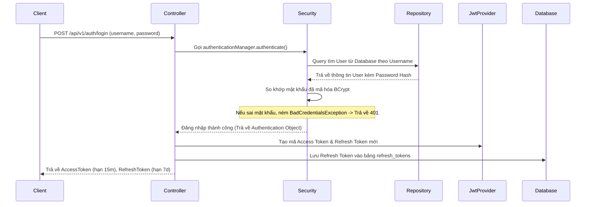
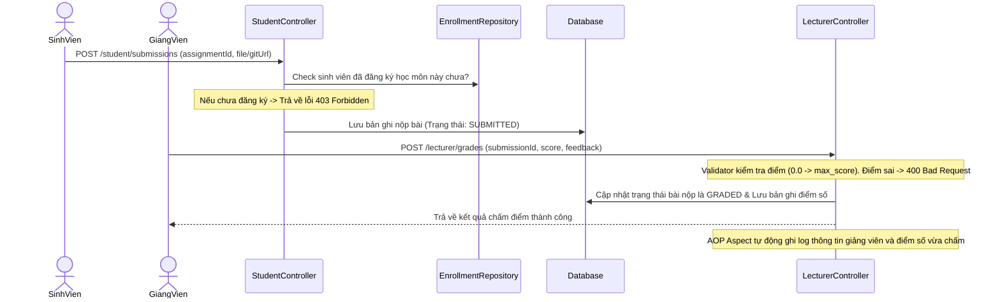
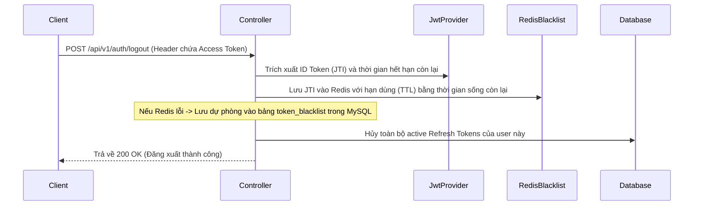

# 🎓 CẨM NANG ÔN TẬP BẢO VỆ ĐỒ ÁN
## Hệ Thống Quản Lý Khóa Học Và Chấm Điểm (CourseHub)

Tài liệu này được viết cực kỳ chi tiết, dành riêng cho người chuẩn bị bảo vệ đồ án nhưng chưa nắm vững lý thuyết. Tài liệu bao gồm: Kiến thức nền tảng, sơ đồ kiến trúc, luồng chạy thực tế của chức năng và các câu hỏi phản biện thường gặp của Hội đồng.

---

## 🗺️ PHẦN 1: KIẾN TRÚC VÀ CÔNG NGHỆ SỬ DỤNG

### 1. Mô hình Kiến trúc: Layered Monolithic (Đơn khối phân lớp)
Dự án được xây dựng theo kiến trúc phân lớp chuẩn của Spring Boot. Luồng đi của dữ liệu đi từ ngoài vào trong:
```text
Client (Swagger UI / Postman)
       ↓  (Yêu cầu HTTP gửi đến)
Controller (Nhận request, validate dữ liệu, phân quyền @PreAuthorize)
       ↓
Service (Xử lý logic nghiệp vụ - Business Logic)
       ↓
Repository (Kết nối và thực thi câu lệnh SQL qua Spring Data JPA)
       ↓
Database (Hệ quản trị cơ sở dữ liệu MySQL / Redis)
```
*   **Controller**: Chỉ đóng vai trò nhận dữ liệu, kiểm tra dữ liệu đầu vào (Validation) và trả về kết quả JSON. Không viết logic xử lý ở đây.
*   **Service**: Nơi chứa toàn bộ bộ não của dự án. Mọi phép toán, kiểm tra điều kiện trùng lặp, logic nghiệp vụ đều nằm ở đây.
*   **Repository**: Giao tiếp với Database, sử dụng các hàm viết sẵn của JPA như `save()`, `findById()`, hoặc custom query `@Query` viết bằng JPQL.

---

### 2. Các công nghệ cốt lõi và lý do sử dụng
1.  **Java 17 & Spring Boot 3.2.5**: Khung làm việc (Framework) giúp tạo ứng dụng web nhanh chóng nhờ tính năng tự động cấu hình (Auto-configuration) và quản lý thư viện tập trung.
2.  **Spring Security & JWT**: Trách nhiệm xác thực (Authentication) và phân quyền (Authorization) người dùng thông qua mã hóa Token.
3.  **MySQL**: Hệ quản trị cơ sở dữ liệu quan hệ (RDBMS) dùng để lưu trữ dữ liệu vĩnh viễn (Người dùng, môn học, điểm số, bài nộp).
4.  **Redis**: Hệ cơ sở dữ liệu lưu trữ trên RAM (In-memory) tốc độ cực cao, dùng để lưu danh sách Token đã bị hủy (Blacklist) khi đăng xuất.
5.  **Spring AOP (Aspect-Oriented Programming)**: Lập trình hướng khía cạnh, dùng để tự động đo đạc thời gian chạy API và ghi log mà không cần viết lặp code ở từng hàm.
6.  **Flyway DB**: Công cụ quản lý lịch sử và các phiên bản nâng cấp cấu trúc cơ sở dữ liệu thông qua các file migration SQL (`V1__init.sql`, `V2...`).

---

## 📚 PHẦN 2: LÝ THUYẾT NỀN TẢNG CẦN THUỘC LÒNG

### 1. Các khái niệm cốt lõi trong Spring Boot
*   **Dependency Injection (DI - Tiêm phụ thuộc)**: Thay vì bạn phải tự khởi tạo đối tượng bằng từ khóa `new` (ví dụ: `UserService userService = new UserServiceImpl()`), Spring Boot sẽ tự tạo sẵn đối tượng đó trong bộ nhớ (gọi là **Spring Bean**) và tự động "tiêm" (gán) nó vào nơi cần dùng.
*   **Inversion of Control (IoC - Đảo ngược điều khiển)**: Spring Container nắm quyền quản lý vòng đời của các Bean thay vì lập trình viên.
*   **Constructor Injection**: Cách tiêm Bean tốt nhất hiện nay (dự án này áp dụng). Spring khuyên dùng cách này thay vì `@Autowired` trên thuộc tính để đảm bảo code dễ viết Unit Test và tránh lỗi tham chiếu Null.
    *   *Ví dụ code trong dự án:*
        ```java
        private final UserService userService;
        // Tiêm qua Constructor:
        public AdminUserController(UserService userService) {
            this.userService = userService;
        }
        ```

---

### 2. REST API & Giao thức HTTP
REST API là một kiểu thiết kế hệ thống web để Client (Frontend) giao tiếp với Server (Backend) thông qua giao thức HTTP.
*   **HTTP Methods (Phương thức truyền)**:
    *   `GET`: Lấy dữ liệu (Ví dụ: xem danh sách lớp học).
    *   `POST`: Tạo mới dữ liệu (Ví dụ: tạo tài khoản, đăng nhập, nộp bài).
    *   `PUT`: Cập nhật/Thay thế toàn bộ dữ liệu.
    *   `PATCH`: Cập nhật một phần dữ liệu (Ví dụ: chỉ cập nhật trạng thái hoạt động).
    *   `DELETE`: Xóa dữ liệu.
*   **HTTP Status Codes (Mã trạng thái phản hồi)**:
    *   `200 OK`: Thành công.
    *   `201 Created`: Tạo mới thành công (thường trả về sau POST).
    *   `400 Bad Request`: Lỗi dữ liệu đầu vào (ví dụ: mật khẩu yếu, nhập điểm quá 100).
    *   `401 Unauthorized`: Chưa xác thực (chưa đăng nhập hoặc token hết hạn).
    *   `403 Forbidden`: Không đủ quyền truy cập (học sinh gọi API giảng viên).
    *   `409 Conflict`: Xung đột dữ liệu (trùng username, email, hoặc số điện thoại).
    *   `500 Internal Server Error`: Lỗi máy chủ (lỗi code chưa xử lý ngoại lệ).

---

### 3. Cơ chế bảo mật JWT (JSON Web Token)
JWT là một chuỗi ký tự được mã hóa gồm 3 phần ngăn cách bởi dấu chấm `.`: `Header.Payload.Signature`
1.  **Header**: Chứa kiểu token (JWT) và thuật toán mã hóa (ví dụ: HS256).
2.  **Payload**: Chứa dữ liệu của người dùng được mã hóa (User ID, Username, Quyền hạn/Role).
3.  **Signature**: Chữ ký số dùng để xác minh tính toàn vẹn của token (được tạo bằng cách kết hợp Header + Payload + một khóa bí mật `JWT_SECRET` trên Server). Nếu ai đó sửa dữ liệu ở Payload, Signature sẽ sai lệch ngay lập tức.

#### 🔄 Phân biệt Access Token và Refresh Token
*   **Access Token**: Thời hạn tồn tại ngắn (**15 phút**). Được gửi kèm mọi Request lên Server ở Header dưới dạng `Authorization: Bearer <Token>`. Dùng để truy cập tài nguyên bảo mật.
*   **Refresh Token**: Thời hạn tồn tại dài (**7 ngày**). Chỉ lưu ở DB và chỉ dùng khi Access Token hết hạn. Client gửi Refresh Token lên API `/refresh` để lấy lại một cặp `AccessToken & RefreshToken` mới mà không bắt người dùng phải gõ lại tài khoản/mật khẩu.
*   **Xoay vòng Refresh Token (Token Rotation)**: Khi dùng Refresh Token cũ để lấy cặp token mới, hệ thống lập tiếp hủy (revoke) Refresh Token cũ đó đi. Nếu có kẻ xấu ăn cắp được Refresh Token cũ và cố tình gửi lại, hệ thống sẽ phát hiện hành vi tái sử dụng trái phép này và lập tức hủy bỏ toàn bộ các phiên làm việc đang hoạt động của người dùng để bảo mật.

---

### 4. Tại sao cần Redis để làm Token Blacklist?
*   **Vấn đề cổ chai (Database Bottleneck)**: JWT mặc định là stateless (không lưu trạng thái). Nếu muốn hủy token trước hạn (khi người dùng nhấn **Logout**), thông thường ta phải lưu token đó vào Database và kiểm tra mỗi khi có API được gọi. Nếu kiểm tra bằng DB MySQL truyền thống, mỗi request API gửi lên sẽ phải query MySQL, gây tắc nghẽn hệ thống khi có hàng triệu người dùng truy cập.
*   **Giải pháp Redis**:
    *   Redis lưu dữ liệu trực tiếp trên RAM, tốc độ đọc ghi cực nhanh (hàng trăm nghìn request/giây).
    *   Khi Logout, hệ thống ném Token ID (JTI) vào Redis với thời gian hết hạn bằng đúng thời gian sống còn lại của Token đó (ví dụ còn 5 phút thì lưu Redis đúng 5 phút).
    *   Mỗi API gửi lên đi qua `JwtAuthenticationFilter` sẽ chỉ mất vài phần triệu giây để check trong Redis.
    *   **Cơ chế Fallback (Dự phòng)**: Nếu Redis bị sập đột ngột, code sẽ bắt ngoại lệ và tự động chuyển sang kiểm tra ở bảng `token_blacklist` trong MySQL. Người dùng không hề nhận thấy hệ thống gặp sự cố.

---

### 5. Lập trình hướng khía cạnh (Spring AOP)
*   **AOP (Aspect-Oriented Programming)**: Giúp tách rời các mã nguồn bổ trợ (như Logging, Transaction, Security) ra khỏi logic nghiệp vụ chính của hàm.
*   **Tại sao dùng?**: Nếu không có AOP, muốn ghi nhận thời gian chạy của 100 API, bạn phải viết 100 lần đoạn code đo thời gian ở đầu và cuối mỗi hàm. Với AOP, bạn chỉ cần tạo một khía cạnh (`Aspect`), định nghĩa nơi áp dụng (`Pointcut`) và logic xử lý (`Advice`), hệ thống tự động chèn code đo đạc vào.
*   **Thuật ngữ cơ bản**:
    *   `Aspect`: Lớp chứa code nghiệp vụ bổ trợ (Ví dụ: [ExecutionTimeAspect.java](file:///d:/CourseHub/src/main/java/com/k24/coursegradingmanagementsystem/aspect/ExecutionTimeAspect.java)).
    *   `Advice`: Hành động thực thi lúc nào (`@Around` bao quanh hàm, `@AfterReturning` sau khi chạy xong không lỗi, `@AfterThrowing` khi xảy ra lỗi).

---

## 🔄 PHẦN 3: LUỒNG HOẠT ĐỘNG CỦA CÁC CHỨC NĂNG CHÍNH

### 1. Luồng Đăng nhập (Login)


---

### 2. Luồng nộp bài & chấm điểm bài tập


---

### 3. Luồng Đăng xuất & Thu hồi Token (Logout)


---

## ❓ PHẦN 4: BỘ CÂU HỎI PHẢN BIỆN THƯỜNG GẶP (Q&A)

#### **Câu 1: Làm thế nào em đảm bảo mật khẩu người dùng được lưu trữ an toàn?**
> **Trả lời:** Em sử dụng thư viện **BCryptPasswordEncoder** của Spring Security. Mật khẩu của người dùng khi đăng ký sẽ được băm (hash) một chiều kèm chuỗi muối (salt) ngẫu nhiên trước khi lưu vào cột `password_hash` trong MySQL. Không ai có thể giải mã ngược lại mật khẩu gốc từ cơ sở dữ liệu.

#### **Câu 2: Tại sao em lại cấu hình kiểm tra trùng số điện thoại ở cả Service thay vì chỉ đặt thuộc tính `UNIQUE` trong Database?**
> **Trả lời:** Đặt `UNIQUE` ở Database là lớp bảo vệ cuối cùng để chống trùng lặp. Tuy nhiên, việc kiểm tra ở lớp Service giúp em chủ động bắt lỗi sớm, ném ra ngoại lệ có định nghĩa rõ ràng (`ConflictException`), và trả về mã phản hồi chuẩn REST API (`490 Conflict` kèm thông báo lỗi chi tiết) thay vì để Database ném lỗi thô gây crash API hoặc trả về lỗi chung 500.

#### **Câu 3: Em kiểm thử (Test) dự án như thế nào?**
> **Trả lời:** Em viết tổng cộng **17 test cases** sử dụng JUnit 5 kết hợp Mockito. Em phân loại làm 2 nhóm:
> 1. **Unit Test (Service)**: Giả lập (Mock) các Repository để chỉ kiểm tra logic nghiệp vụ của Service.
> 2. **Integration Test (Controller)**: Sử dụng `MockMvc` để kiểm thử endpoint API thực tế, giả lập các request JSON truyền lên, kiểm tra xem nó có validate đúng cấu trúc dữ liệu không và có chặn phân quyền (401/403) đúng thiết kế không.

#### **Câu 4: Nếu học sinh đã đăng ký khóa học, admin có xóa được khóa học đó không? Tại sao?**
> **Trả lời:** **Không thể xóa được ạ**. Trong code xử lý xóa khóa học, em kiểm tra bảng `enrollments`. Nếu có bất kỳ học sinh nào đang tham gia khóa học (`ENROLLED`), hệ thống lập tức ném ra `BusinessRuleException` và chặn hoạt động xóa để đảm bảo an toàn dữ liệu lịch sử. Thay vì xóa, Admin phải chuyển trạng thái khóa học sang `CLOSED` hoặc `COMPLETED`.

#### **Câu 5: Tại sao khi học sinh chọn hủy môn học, em lại cập nhật trạng thái `CANCELLED` mà không xóa cứng dòng đó trong database?**
> **Trả lời:** Để phục vụ cho việc lưu trữ dữ liệu lịch sử (Audit trail). Chuyển trạng thái sang `CANCELLED` vừa giúp giải phóng vị trí trống trong lớp học cho sinh viên khác đăng ký, vừa giữ lại được vết hoạt động học tập của sinh viên đó, đồng thời tránh lỗi mồ côi dữ liệu nếu sinh viên đó đã nộp bài tập trước đó.
